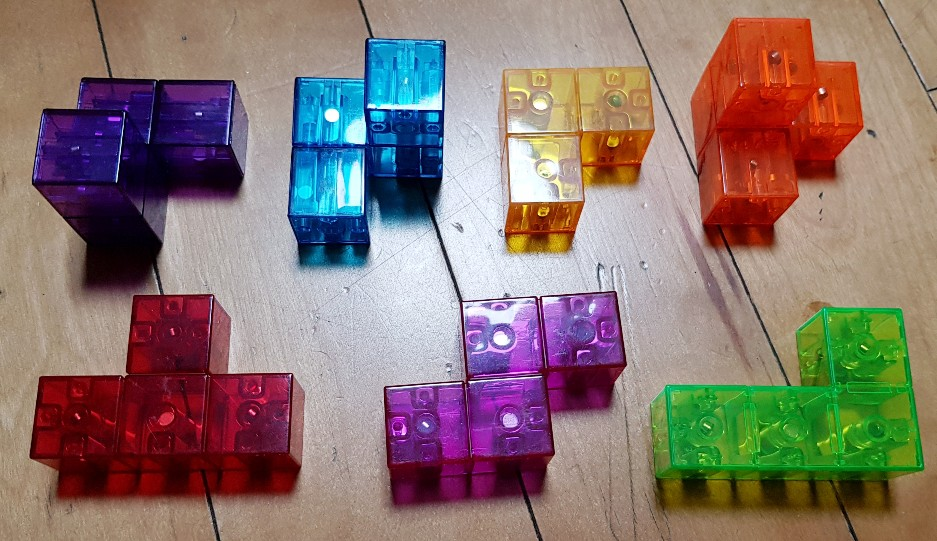

## How many ways to make a 3x3x3 cube from the seven blocks?


* Block numbers in the above figure
```
3 2 1 6
7  5  4
```

* Answer: [339](sol.txt) 

## Approach
1. Find all moves of blocks
    1. Rotate each block: Symmetric group S4, Alternating group A4
    2. Translate each rotated block
2. Place blocks in order
    * Depth-first search

## Cube representation
### Coordinate
```
000 001 002  100 101 102  200 201 202
010 011 012  110 111 112  210 211 212
020 021 022  120 121 122  220 221 222
```

### Interchangeable position
* Vertex
```
{000, 002, 020, 022, 200, 202, 220, 222}
```
* Edge
```
{001, 010, 012, 021,
 100, 102, 120, 122,
 201, 210, 212, 221}
```
* Face
```
{011, 101, 110, 112, 121, 211}
```
* Center
```
{111}
```
* 8Vertex+12Edge+6Face+1Center  
`8eee+12eeo+6eoo+1ooo=(2e+o)^3`

### Operation
* Properties
    1. Preserve Even/Odd  
 `(a,b,c), (2-a,b,c), (a,2-b,c), (a,b,2-c)`
    2. Permutation  
 `(a,b,c), (a,c,b), (b,a,c), (b,c,a), (c,a,b), (c,b,a)`
* Simple operation: Rotation & Flip
    1. Rotation through diagonal axis  
`(a,b,c) <-> (b,c,a) <-> (c,a,b)`
    2. Flip against the parallel faces  
`(a,b,c) <-> (2-a,b,c)`  
`(a,b,c) <-> (a,2-b,c)`  
`(a,b,c) <-> (a,b,2-c)`
    3. Flip against the diagonal planes  
`(a,b,c) <-> (a,c,b)`  
`(a,b,c) <-> (b,a,c)`  
`(a,b,c) <-> (c,b,a)`  

## Solution
```
sol:001 (0+000, 0+100, 2+111, 0+002, 3+021, 2+010, 8+200)
114  224  724
614  233  773
665  655  753
```
* A cube has the three planes of 3x3.
* Numbers indicate the block id's.
* In `i+ddd`, `ddd` represents the translation in each axis.

### Block in string format
```
330  000  000
300  300  000
000  000  000
```
is inside the bounding box of the tensor shape `(2,2,2)` like 
```
11  00
10  10
```
The dimension of the bounding box and the occupancy is combined as 
`'22211100010'`.
